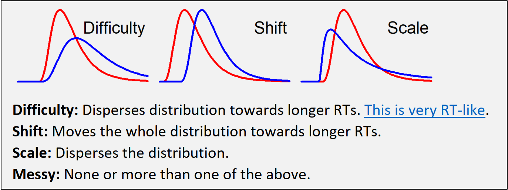

# Get everything up and running

## Initialize environment
**Setting up R libraries**

```{r set up libraries,echo=FALSE,warning=FALSE,message=FALSE,results="hide"}
# Setup the work environment
options(width=120,scipen=0,digits=6) # change output width (for better printing), scientific notation (to disable it: scipen=999), constrain output to 3 decimals
cat("\014") # clear console
# dev.off() # clear plots (if no plots are present, comment it out or it will throw an error)
rm(list=ls()) # clear environment
wd="C:/Users/psy05cvd/Dropbox/work/R-statistics/experiments/ssvep_posnalpha_behave/" # work directory
# setwd(wd) # set work directory

# Load relevant libraries:
library(dplyr)
library(tidyverse)
library(kableExtra)
library(broom)
library(broom.mixed)

library(brms)
library(afex)
library(emmeans)

library(ggplot2)
library(ggbeeswarm)
library(tidybayes)
library(cowplot)


library(ggdist)
library(ggpubr)


# library(plyr)
# library(psych)
# library(ez)
# library(ggplot2)
# library(lsr)
# library(kableExtra)
# library(ggbeeswarm)
# library(afex)
# library(lmerTest)
# library(emmeans)
# library(lsmeans)
# # library(sjPlot)
# library(viridis)
# library(multcomp)
# 
# library(cowplot)
# library(dplyr)
# library(readr)
# 
# library(ggpol)
# library(ggpubr)
# library(effectsize)
# 
# library(broom)
# 
# library(brms)
# library(tidybayes)
# library(bayesplot)
# library(modelr)
# library(broom.mixed)
# library(magrittr)
# library(rstan)
# library(posterior)
# 
# library(mediation)
# library(bayestestR)
# library(rstanarm)
# 
# library(ggdist)

# source('C:/Users/psy05cvd/Dropbox/work/R-statistics/general_functions/RainCloudPlots/tutorial_R/R_rainclouds.R')
# source('C:/Users/psy05cvd/Dropbox/work/R-statistics/general_functions/RainCloudPlots/tutorial_R/summarySE.R')
# source('C:/Users/psy05cvd/Dropbox/work/R-statistics/general_functions/RainCloudPlots/tutorial_R/simulateData.R')

datafile1 <- "data_in/Behavior_FFT_singletrials_cue.txt"
timewindows = c("[-1000 0]ms", "[0 1000]ms", "[500 1500]ms")

```
<style type="text/css">
.main-container {
max-width: 1800px !important;
margin-left: auto;
margin-right: auto;
}
</style>

<br>  

## load single trial data
Loading data `r toString(datafile1)`

The data has the following structure

* trialnumber = trial
* blocknumber
* trial_timing_type = 1=regular; 2=control
* cue_validity = 1=valid, 2=invalid, 3=neutral
* cue_validity_label
* cue_direction = 1=left, 2=right
* cue_direction_label
* cue_onset_fr = frame number of cue presentation
* cue_onset_t_est = onset time in ms
* cue_onset_t_meas = nan
* pre_event_type = 1=shorter, 2=longer, NaN=no event
* pre_event_onset_fr = onset frame of event
* pre_event_onset_t_est = onset time in ms
* pre_event_onset_t_meas = nan
* post_event_pos = position of post event: 1 = left, 2=right
* post_event_pos_label
* post_event_direction = direction of target (-90:90)=top; 
* post_event_direction_c = category of target position: 1=top; 2=bottom
* post_event_direction_c_l = label
* post_event_dimenstion = size in degrees
* post_event_onset_fr = onset frames of event
* post_event_onset_t_est = onset times of events
* post_event_onset_t_meas = nan
* triggernum = trigger number
* pre_hit = empty=no event, TRUE=hit, 0=error, NaN=miss
* pre_RT = RT in ms
* post_hit = TRUE=hit, 0=error, NaN=miss
* post_RT = RT in ms
* subject
* FFT measures ...

```{r load data,echo=FALSE,warning=FALSE,message=FALSE,results="hide"}
# Load the data
DATA.In_long <- read.csv(datafile1, header=TRUE,check.names=FALSE, sep =",", dec = ".")
#str(DATA.In_long)
DATA.In_long$trialnumber <- as.factor(DATA.In_long$trialnumber)
DATA.In_long$blocknumber <- as.factor(DATA.In_long$blocknumber)
DATA.In_long$trial_timing_type <- as.factor(DATA.In_long$trial_timing_type)
DATA.In_long$cue_validity <- as.factor(DATA.In_long$cue_validity)
DATA.In_long$cue_direction <- as.factor(DATA.In_long$cue_direction)
DATA.In_long$pre_event_type <- as.factor(DATA.In_long$pre_event_type)
DATA.In_long$post_event_pos <- as.factor(DATA.In_long$post_event_pos)
DATA.In_long$post_event_direction_c <- as.factor(DATA.In_long$post_event_direction_c)

DATA.In_long <- DATA.In_long %>%
  mutate(post_hit = case_when(
    post_hit == "1" ~ "hit",
    post_hit == "NaN" ~ "miss",
    post_hit == "0" ~ "error"
  ))
```

## wrangle data
from *long* formant to *longer* format


```{r edit data,echo=FALSE,warning=FALSE,message=FALSE}
DATA.In_longer <- DATA.In_long %>%
  pivot_longer(
    cols = SSVEP_leftStim_win1:visualAlpha_rightStim_win3,
    names_to = c("signal","side","time"),
    names_pattern = "(.*)_(.*)_(.*)",
    values_to = "amplitude"
  ) %>%
  mutate(pos_rel_target = as.factor(ifelse(
    post_event_pos_label == "left" & (side == "leftHand" | side == "leftStim"), "contra_target", ifelse(
      post_event_pos_label == "right" & (side == "leftHand" | side == "leftStim"), "contra_nontarget", ifelse(
        post_event_pos_label == "left" & (side == "rightHand" | side == "rightStim"), "contra_nontarget", "contra_target"
      )
    ))
  ))%>%
  mutate(attention = case_when(
    pos_rel_target == "contra_target" & cue_validity_label == "valid" ~ "cued",
    pos_rel_target == "contra_target" & cue_validity_label == "invalid" ~ "uncued",
    pos_rel_target == "contra_nontarget" & cue_validity_label == "valid" ~ "uncued",
    pos_rel_target == "contra_nontarget" & cue_validity_label == "invalid" ~ "cued",
    cue_validity_label == "neutral" ~ "neutral"
  ))%>%
  mutate(attention = factor(attention, levels=c('uncued','neutral','cued'), ordered = T))%>%
  mutate(time=case_when(
    time == "win1" ~ timewindows[1],
    time == "win2" ~ timewindows[2],
    time == "win3" ~ timewindows[3]
  )) %>%
  # attempt to zscore data
  group_by(subject, signal, side, time)%>%
  mutate("Zamplitude" = scale(amplitude))%>%
  ungroup

DATA.In_longer %>%
  filter(signal=="visualAlpha", time == "[500 1500]ms")%>%
  head()%>%
  kable()%>%
  kable_styling("striped", full_width = T, bootstrap_options = c("striped", "hover", "condensed", "responsive",font_size = 8))%>%
  scroll_box(width = "800px")


# mapvalues(DATA.In_longer$time, from=c("win1", "win2","win3"), to=timewindows)

```

# Motivation

The main idea of the experiment was to examine which factors, parameters, processes and neural signals affect behavior in *spatial attenion* **Posner paradigm**. More specifically, as a follow up of some previous work (Gundlach et al., 2020), we wanted to know whether the two independent neural signals, **SSVEP** (as a marker of early sensory gain) and **alpha-band amplitudes** represent processes relevant for behavior.

So we wanted to know whether (trial-by-trial) variance of reaction times to spatially *validly*, *invalidly* or *neutrally* cued target stimuli...

<br>  

```{r RT distribution all trials, results = "hide",  fig.height=3, fig.width=3, warning = FALSE, message=FALSE}
dat_plot <- DATA.In_longer %>%
  dplyr::select(subject, trialnumber, cue_validity_label, post_event_pos_label, time, post_hit, post_RT)%>%
  filter(post_hit=="hit", time=="[500 1500]ms")%>%
  group_by(subject, trialnumber,cue_validity_label)%>%
  dplyr::summarise(post_RT=mean(post_RT))


theme_set(theme_bw())
ggplot(dat_plot, aes(x=post_RT)) +
  stat_dots(position = "dodgejust") +
  labs(
    title = "Reaction times for hits",
    subtitle = "all trials for N = 28 subjects",
    x = "RT in ms",
    y = "density"
  )+ 
  theme(panel.grid.major = element_blank(), panel.grid.minor = element_blank())
```

<br>
...is related to trial-by-trial variance of amplitude values of post-cue [500 to 1500]ms  **alpha-band activity** ...

```{r SSVEP and alpha distribution all trials, results = "hide",  fig.height=3, fig.width=3, warning = FALSE, message=FALSE}
dat_plot <- DATA.In_longer %>%
  dplyr::select(subject, trialnumber,time, cue_validity_label, pos_rel_target, amplitude, signal, post_hit)%>%
  filter(post_hit=="hit", time=="[500 1500]ms", signal == "visualAlpha")%>%
  group_by(subject, trialnumber,cue_validity_label, signal)%>%
  summarise(amplitude=mean(amplitude))


theme_set(theme_bw())
ggplot(dat_plot, aes(x=amplitude)) +
  stat_dots(position = "dodgejust") +
  labs(
    title = "Single-trial amps vis. alpha",
    subtitle = "all trials for N = 28 subjects",
    x = expression(paste("amplitude in ", mu,"V")),
    y = "density"
  )
```

<br>
We do know that all these signals are modulated by attention. But do the electrophysiological measures correspond to (or even represent) processes relevant for instantiating behaviorally relevant attention processes?


```{r RT, alpha and SSVEP distributions, results = "hide",  fig.height=3.5, fig.width=5, warning = FALSE, message=FALSE}

dat_plot <- DATA.In_longer %>%
  dplyr::select(subject, trialnumber, time, cue_validity_label, post_event_pos_label, post_hit, post_RT)%>%
  filter(post_hit=="hit", time=="[500 1500]ms")%>%
  group_by(subject, trialnumber,cue_validity_label)%>%
  summarise(post_RT=mean(post_RT))

mu <- dat_plot %>%
  group_by(subject, cue_validity_label)%>%
  summarize(RT = mean(post_RT,na.rm = TRUE))%>%
  ungroup()%>%
  group_by(cue_validity_label)%>%
  summarize(grp.mean = mean(RT,na.rm = TRUE), grp.median = median(RT,na.rm = TRUE))


theme_set(theme_bw())
plot1 <-
  ggplot(dat_plot, aes(
    x = post_RT, 
    fill = cue_validity_label
  )) +
  stat_slab(
    height = 2, color = "gray15",
    alpha = 0.8,
    expand = TRUE, trim = TRUE,
    fill_type = "segments",
    show.legend = FALSE,
    position = position_dodgejust(0.3),
  )+
  theme(axis.text.y=element_blank(),axis.ticks.y=element_blank(), axis.title.y = element_blank())+
  theme(axis.text.x=element_blank(),axis.ticks.x=element_blank(), axis.title.x = element_blank())+
  theme(panel.grid.major = element_blank(), panel.grid.minor = element_blank())+
  scale_fill_manual(values=c("#F1831A", "#293C4A", "#198A83")) +
  scale_color_manual(values=c("#F1831A", "#293C4A", "#198A83"))+
  xlim(c(200, 1200))

plot2 <-
  ggplot(dat_plot, aes(
    x = post_RT, 
    fill = cue_validity_label
  )) +
  stat_pointinterval(position = position_dodge(width = .4, preserve = "single"), 
                     aes(color=cue_validity_label)) +
  theme(axis.text.y=element_blank(),axis.ticks.y=element_blank(), axis.title.y = element_blank())+
  theme(panel.grid.major = element_blank(), panel.grid.minor = element_blank())+
  scale_x_continuous(name="RT in ms", breaks=c(200,400,600,800,1000,1200), labels=waiver(), limits=c(200,1200))+
  scale_fill_manual(name = "cue", values=c("#F1831A", "#293C4A", "#198A83")) +
  scale_color_manual(name = "cue", values=c("#F1831A", "#293C4A", "#198A83"))


# cowplot::plot_grid(plot1, plot2, plot3, ncol = 3,labels = "AUTO")
plotttitle <- ggdraw() + draw_label("RT in ms", fontface='bold')
plotplots <- ggarrange(plot1, plot2, nrow = 2, align = "v", heights =c(4,2), common.legend = TRUE)
ggarrange(plotttitle, plotplots, nrow = 2, heights=c(0.1, 1))

pl.xlim = c(0, 25)

# alpha contra target
dat_plot <- DATA.In_longer %>%
  dplyr::select(subject, trialnumber, cue_validity_label, post_event_pos_label, post_hit, amplitude, signal, pos_rel_target, time)%>%
  filter(post_hit=="hit", signal == "visualAlpha", pos_rel_target == "contra_target", time == "[500 1500]ms")

mu <- dat_plot %>%
  group_by(subject, cue_validity_label)%>%
  summarize(amplitude = mean(amplitude,na.rm = TRUE))%>%
  ungroup()%>%
  group_by(cue_validity_label)%>%
  summarize(grp.mean = mean(amplitude,na.rm = TRUE), grp.median = median(amplitude,na.rm = TRUE))

theme_set(theme_bw())
plot1 <-
  ggplot(dat_plot, aes(
    x = amplitude,
    fill = cue_validity_label
  )) +
  stat_slab(
    height = 2, color = "gray15",
    expand = TRUE, trim = TRUE,
    alpha = 0.8,
    fill_type = "segments",
    show.legend = FALSE,
    position = position_dodgejust(0.3),
  )+
  theme(axis.text.y=element_blank(),axis.ticks.y=element_blank(), axis.title.y = element_blank())+
  theme(axis.text.x=element_blank(),axis.ticks.x=element_blank(), axis.title.x = element_blank())+
  theme(panel.grid.major = element_blank(), panel.grid.minor = element_blank())+
  scale_fill_manual(name = "cue", values=c("#F1831A", "#293C4A", "#198A83")) +
  scale_color_manual(name = "cue", values=c("#F1831A", "#293C4A", "#198A83"))+
  xlim(pl.xlim)

plot2 <-
  ggplot(dat_plot, aes(
    x = amplitude, 
    fill = cue_validity_label
  )) +
  stat_pointinterval(position = position_dodge(width = .4, preserve = "single"), 
                     aes(color=cue_validity_label)) +
  theme(axis.text.y=element_blank(),axis.ticks.y=element_blank(), axis.title.y = element_blank())+
  theme(panel.grid.major = element_blank(), panel.grid.minor = element_blank())+
  scale_x_continuous(name= expression(paste("amplitude in ", mu,"V")), breaks=waiver(), labels=waiver(), limits=pl.xlim)+
  scale_fill_manual(name = "cue", values=c("#F1831A", "#293C4A", "#198A83")) +
  scale_color_manual(name = "cue", values=c("#F1831A", "#293C4A", "#198A83"))


# cowplot::plot_grid(plot1, plot2, plot3, ncol = 3,labels = "AUTO")
plotttitle <- ggdraw() + draw_label("alpha-band amplitude contra target", fontface='bold')
plotplots <- ggarrange(plot1, plot2, nrow = 2, align = "v", heights =c(4,2), common.legend = TRUE)
ggarrange(plotttitle, plotplots, nrow = 2, heights=c(0.1, 1))

# alpha contra nontarget
dat_plot <- DATA.In_longer %>%
  dplyr::select(subject, trialnumber, cue_validity_label, post_event_pos_label, post_hit, amplitude, signal, pos_rel_target, time)%>%
  filter(post_hit=="hit", signal == "visualAlpha", pos_rel_target == "contra_nontarget", time == "[500 1500]ms")

mu <- dat_plot %>%
  group_by(subject, cue_validity_label)%>%
  summarize(amplitude = mean(amplitude,na.rm = TRUE))%>%
  ungroup()%>%
  group_by(cue_validity_label)%>%
  summarize(grp.mean = mean(amplitude,na.rm = TRUE), grp.median = median(amplitude,na.rm = TRUE))

theme_set(theme_bw())
plot1 <-
  ggplot(dat_plot, aes(
    x = amplitude, 
    fill = cue_validity_label
  )) +
  stat_slab(
    height = 2, color = "gray15",
    expand = TRUE, trim = TRUE,
    fill_type = "segments",
    alpha = 0.8,
    show.legend = FALSE,
    position = position_dodgejust(0.3),
  )+
  theme(axis.text.y=element_blank(),axis.ticks.y=element_blank(), axis.title.y = element_blank())+
  theme(axis.text.x=element_blank(),axis.ticks.x=element_blank(), axis.title.x = element_blank())+
  theme(panel.grid.major = element_blank(), panel.grid.minor = element_blank())+
  scale_fill_manual(values=c("#F1831A", "#293C4A", "#198A83")) +
  scale_color_manual(values=c("#F1831A", "#293C4A", "#198A83"))+
  xlim(pl.xlim)

plot2 <-
  ggplot(dat_plot, aes(
    x = amplitude, 
    fill = cue_validity_label
  )) +
  stat_pointinterval(position = position_dodge(width = .4, preserve = "single"), 
                     aes(color=cue_validity_label)) +
  theme(axis.text.y=element_blank(),axis.ticks.y=element_blank(), axis.title.y = element_blank())+
  theme(panel.grid.major = element_blank(), panel.grid.minor = element_blank())+
  scale_x_continuous(name= expression(paste("amplitude in ", mu,"V")), breaks=waiver(), labels=waiver(), limits=pl.xlim)+
  scale_fill_manual(name = "cue",values=c("#F1831A", "#293C4A", "#198A83")) +
  scale_color_manual(name = "cue",values=c("#F1831A", "#293C4A", "#198A83"))


# cowplot::plot_grid(plot1, plot2, plot3, ncol = 3,labels = "AUTO")
plotttitle <- ggdraw() + draw_label("alpha-band amplitude contra nontarget", fontface='bold')
plotplots <- ggarrange(plot1, plot2, nrow = 2, align = "v", heights =c(4,2), common.legend = TRUE)
ggarrange(plotttitle, plotplots, nrow = 2, heights=c(0.1, 1))

```

<br>
...there are overall a lot of trials for each participant

```{r num trials, results = "hide",  fig.height=3.5, fig.width=8, warning = FALSE, message=FALSE}
DATA.In_longer %>%
  dplyr::select(subject, trialnumber,time, cue_validity_label, pos_rel_target, amplitude, signal, post_hit)%>%
  filter(post_hit=="hit", time=="[500 1500]ms", signal == "SSVEP", pos_rel_target == "contra_nontarget")%>%
  group_by(subject)%>%
  summarise(trialnum=n())%>%
  summarise(N=n(),total_trials = sum(trialnum), mean_trials = mean(trialnum), sd_trials = sd(trialnum))%>%
  kable(escape = F, digits = c(6,6,6,6,6,6,6,6,6), caption = c("overall number of trials | for hits")) %>%
  kable_styling("striped", full_width = T, bootstrap_options = c("striped", "hover", "condensed", "responsive",font_size = 8))


DATA.In_longer %>%
  dplyr::select(subject, trialnumber,time, cue_validity_label, pos_rel_target, amplitude, signal, post_hit)%>%
  filter(post_hit=="hit", time=="[500 1500]ms", signal == "SSVEP", pos_rel_target == "contra_nontarget")%>%
  group_by(subject,cue_validity_label)%>%
  summarise(trialnum=n())%>%
  group_by(cue_validity_label)%>%
  summarise(N=n(),total_trials = sum(trialnum),mean_trials = mean(trialnum), sd_trials = sd(trialnum))%>%
  kable(escape = F, digits = c(6,6,6,6,6,6,6,6,6), caption = c("number of trials per condition | for hits")) %>%
  kable_styling("striped", full_width = T, bootstrap_options = c("striped", "hover", "condensed", "responsive",font_size = 8))


```

<br>

# Analysis Pipeline with brms package
## Intro and Overview

The main research question boils down to: do **attention**, **ssvep amplitudes** and **alpha-band amplitudes** have an impact on the reaction times, i.e. do they shift the distribution of reaction times?
Since reaction time distributions differ from the normal distribution (they are for instance not continous and skewed), a mere analysis of the mean may not be the most appropriate procedure. So how can an analysis be implemented?

Some great ideas come from Jonas Kristoffer Lindeløv: https://lindeloev.shinyapps.io/shiny-rt/

A good way to describe RT distribution is to see them as a *log-transformed normal distribution*. It’s called *“log-normal”* because the parameters are the *mean* and *sd* of the log-transformed RTs, which is assumed to be a normal (Gaussian) distribution. These distributions can be modelled with three relevant paremeters:


<br>
Now what we want to do is check, whether ~~all~~ any of our measures alters parameters of the RT distribution in a systematic and reliable way, i.e. makes reaction times faster or slower for all subjects.

One way of doing this, as also described in the above *shinyapp* is using the `brms` package in R, to model reaction times distributions and their modulations by certain factors. The standard model parameter to be altered by some external factor is **difficulty/mu/$\mu$**.

A potential workflow could be:

1. Fit relevant models wit varying complexity (i.e. intercept model, model incorporating all potential predictors)
2. Compare different models and select the model describing the data best but also most efficiently (i.e. include penalties for the complexity of the model)
3. Extract marginal effects from 'best' model to say something about how and which predictors affect the reaction times

## Implementing the workflow

### Fitting the models
<br>
We are fitting several different models differing in complexity. The brms packages uses some sophisticated sampling procedures to navigate through the parameter space and find the best parameters. For all the parameters priors can (and actually should be applied). This is, however, tricky, as the format of the parameters is not totally clear to me: i.e. for lognormal distributions one should specify the expected size of the effect, the intercept, the shift of the distribution etc. Whether the parameters relate to the actual *RT in ms* or *log(RT in ms)* is not clear to me and may even differ across parameters.

**Footnotes**:

* the NDT parameter for instance seems to relate to *RT in ms* while intercept or effect priors seem to relate to *log(RT in ms)*; again some thoughts here https://discourse.mc-stan.org/t/weakly-informative-priors-for-shifted-lognormal/16206 and here https://lindeloev.shinyapps.io/shiny-rt/#43_priors_and_descriptives

* some handcoded testing/simulations revealed that *no prior* vs *post-hoc a priori priors derived from the parameter space of fitted data* performed comparable, so the standard priors worked in this case; while badly scaled *a prior priors* messed up the fits quite a bit

Usually the modell fitting takes some time as repeatedly fits models for a number of times (by default 4000) and should be run on a dedicated workstation. But specifying a name for the logfile saves the model fit and just re-estimates it in case of any changes.

The models specified so far:

*basic models*

* intercept model: **RT ~ 1 + ( 1 | subjects)**
* validity model: **RT ~ Cue + ( cue | subjects)**

*visual alpha models*

* contra target: **RT ~ visual_alpha_Targ + ( 1 | subjects)**
* contra target + validity: **RT ~ Cue +  visual_alpha_Targ + ( cue | subjects)**
* contra nontarget: **RT ~ visual_alpha_NonTarg + ( 1 | subjects)**
* contra nontarget + validity: **RT ~ Cue +  visual_alpha_NonTarg + ( cue | subjects)**

*combined alpha models*

* contra target + contra nontarget: **RT ~ visual_alpha_Targ + visual_alpha_NonTarg + ( 1 | subjects)**
* contra target + contra nontarget + validity: **RT ~ Cue + visual_alpha_Targ + visual_alpha_NonTarg + ( cue | subjects)**


all models were additionally modelled with interaction terms of **cue x signal**


```{r model fits, results = "hide",  fig.height=3.5, fig.width=5, warning = FALSE, message=FALSE}
modeldata = DATA.In_long %>%
  filter(post_hit == "hit")

# intercept model
fit_intercept = brm(formula = post_RT ~ 1 + (1|subject),
                    data = modeldata, 
                    family = shifted_lognormal(),
                    file = 'fit_intercept_slog',
                    save_pars = save_pars(all = TRUE),
                    file_refit = "on_change",
                    cores = 4
                    # file_refit = "always"
)  # Save all that hard work.


# validity model
fit_validity = brm(formula = post_RT ~ cue_validity_label + (cue_validity_label|subject),
                   data = modeldata, 
                   family = shifted_lognormal(),
                   file = 'fit_validity_slog',
                   save_pars = save_pars(all = TRUE),
                   file_refit = "on_change",
                   cores = 4
                   # file_refit = "always"
)  # Save all that hard work.


# alter data to extract post-cue alpha contra to target
modeldata2 = DATA.In_longer %>%
  filter(post_hit == "hit", signal == "visualAlpha", time == "[500 1500]ms", pos_rel_target == "contra_target")%>%
  mutate(post_cue_vis_alpha_contra_target = amplitude)

# visual alpha contra target
fit_visalpha = brm(formula = post_RT ~ post_cue_vis_alpha_contra_target + (1|subject),
                   data = modeldata2, 
                   family = shifted_lognormal(),
                   file = 'fit_visalpha_slog',
                   save_pars = save_pars(all = TRUE),
                   file_refit = "on_change",
                   cores = 4
                   # file_refit = "always"
)  # Save all that hard work.

# visual alpha contra target + validity
fit_validity_visalpha = brm(formula = post_RT ~ cue_validity_label + post_cue_vis_alpha_contra_target + (cue_validity_label|subject),
                            data = modeldata2, 
                            family = shifted_lognormal(),
                            file = 'fit_validity_visalpha_slog',
                            save_pars = save_pars(all = TRUE),
                            file_refit = "on_change",
                            cores = 4
                            # file_refit = "always"
)  # Save all that hard work.

# visual alpha contra target * validity
fit_validity_x_visalpha = brm(formula = post_RT ~ cue_validity_label * post_cue_vis_alpha_contra_target + (cue_validity_label|subject),
                              data = modeldata2, 
                              family = shifted_lognormal(),
                              file = 'fit_validity_x_visalpha_slog',
                              save_pars = save_pars(all = TRUE),
                              file_refit = "on_change",
                              cores = 4
                              # file_refit = "always"
)  # Save all that hard work.

# alter data to extract post-cue alpha contra to nontarget
modeldata3 = DATA.In_longer %>%
  filter(post_hit == "hit", signal == "visualAlpha", time == "[500 1500]ms", pos_rel_target == "contra_nontarget")%>%
  mutate(post_cue_vis_alpha_contra_nontarget = amplitude)

# visual alpha contra nontarget 
fit_alpha2 = brm(formula = post_RT ~ post_cue_vis_alpha_contra_nontarget + (1|subject),
                 data = modeldata3, 
                 family = shifted_lognormal(),
                 file = 'fit_visalpha2_slog',
                 save_pars = save_pars(all = TRUE),
                 file_refit = "on_change",
                 cores = 4
                 # file_refit = "always",
)  # Save all that hard work.

# visual alpha contra nontarget + validity
fit_validity_alpha2 = brm(formula = post_RT ~ cue_validity_label + post_cue_vis_alpha_contra_nontarget + (cue_validity_label|subject),
                          data = modeldata3, 
                          family = shifted_lognormal(),
                          file = 'fit_validity_visalpha2_slog',
                          save_pars = save_pars(all = TRUE),
                          file_refit = "on_change",
                          cores = 4
                          # file_refit = "always"
)  # Save all that hard work.

# visual alpha contra nontarget + validity
fit_validity_x_alpha2 = brm(formula = post_RT ~ cue_validity_label * post_cue_vis_alpha_contra_nontarget + (cue_validity_label|subject),
                            data = modeldata3, 
                            family = shifted_lognormal(),
                            file = 'fit_validity_x_visalpha2_slog',
                            save_pars = save_pars(all = TRUE),
                            file_refit = "on_change",
                            cores = 4
                            # file_refit = "always"
)  # Save all that hard work.

# combined alpha model
# alter data to extract post-cue alpha contra to target
modeldata4 = DATA.In_longer %>%
  filter(post_hit == "hit", signal == "visualAlpha", time == "[500 1500]ms")%>%
  dplyr::select(subject, trialnumber, cue_validity_label, post_RT, pos_rel_target, amplitude) %>%
  pivot_wider(names_from = "pos_rel_target", values_from = amplitude)

# visual alpha contra target and contra non-target
fit_alpha1_alpha2 = brm(formula = post_RT ~ contra_target + contra_nontarget + (1|subject),
                        data = modeldata4, 
                        family = shifted_lognormal(),
                        file = 'fit_visalpha1_visalpha2_slog',
                        save_pars = save_pars(all = TRUE),
                        file_refit = "on_change",
                        cores = 4
                        # file_refit = "always"
)  # Save all that hard work.

# visual alpha contra target and contra non-target + validity
fit_validity_alpha1_alpha2 = brm(formula = post_RT ~ cue_validity_label + contra_target + contra_nontarget + (cue_validity_label|subject),
                                 data = modeldata4, 
                                 family = shifted_lognormal(),
                                 file = 'fit_validity_visalpha1_visalpha2_slog',
                                 save_pars = save_pars(all = TRUE),
                                 file_refit = "on_change",
                                 cores = 4
                                 # file_refit = "always"
)  # Save all that hard work.

# visual alpha contra target and contra non-target + validity
fit_validity_x_alpha1_alpha2 = brm(
  formula = post_RT ~ cue_validity_label * contra_target + cue_validity_label * contra_nontarget + (cue_validity_label|subject),
  data = modeldata4, 
  family = shifted_lognormal(),
  file = 'fit_validity_x_visalpha1_visalpha2_slog',
  save_pars = save_pars(all = TRUE),
  file_refit = "on_change",
  cores = 4
  # file_refit = "always"
)  # Save all that hard work.


```

### Looking into the models
<br>

there are different ways of visualizing each model
such as `summary(fit_validity_visalpha)` to see all the important parameters for the model.
How about convergence of the model?
"The Rhat value provides information on the convergence of the algorithm (cf., Gelman and Rubin, 1992). If Rhat is considerably greater than 1 (i.e., > 1.1), the chains have not yet converged and it is necessary to run more iterations and/or set stronger priors."
Bürkner, P.-C. (2017). brms: An R Package for Bayesian Multilevel Models Using Stan. Journal of Statistical Software, 80, 1–28. https://doi.org/10.18637/jss.v080.i01

```{r disp_model summary,  fig.height=3.5, fig.width=8, warning = FALSE, message=FALSE}
# ## useful functions to evaluate best model
# # extract summary of model
summary(fit_validity_visalpha)
```

or `tidy(fit_validity_visalpha)` to have a glimpse at the summary of all the fitted parameters

```{r disp_model tidy,  fig.height=3.5, fig.width=8, warning = FALSE, message=FALSE}
# # extract all fitted parameters with summary
tidy(fit_validity_visalpha) %>%
  kable(escape = F, digits = c(6,6,6,6,6,6,6,6,6), caption = c("summary of all the model parameters")) %>%
  kable_styling("striped", full_width = T, bootstrap_options = c("striped", "hover", "condensed", "responsive",font_size = 8))
```

or `coef(fit_validity_visalpha)` to see the actual parameters for all participants

```{r disp_model coeff_fit,  fig.height=3.5, fig.width=8, warning = FALSE, message=FALSE}
# # see all coefficients
coef(fit_validity_visalpha) %>%
  kable(escape = F, digits = c(6,6,6,6,6,6,6,6,6), caption = c("model parameters for all subjects | summarised across draws")) %>%
  kable_styling("striped", full_width = T, bootstrap_options = c("striped", "hover", "condensed", "responsive",font_size = 8))%>%
  scroll_box(width = "800px")
```

or `plot(fit_validity_visalpha, ask = FALSE)` to see the distributions of parameters;
the catarpillar plot should look like noisy eeg channel data

```{r disp_model plot model coeff distr,  fig.height=5.5, fig.width=8, warning = FALSE, message=FALSE}
# # plot distributions of parameters and evaluation across single draws (catarpillar plot: should look like a noisy eeg channel)
plot(fit_validity_visalpha, ask = FALSE)
```

or `plot(conditional_effects(fit_validity_visalpha), ask = FALSE)` to see the actual effects of the model and their impact on the dependent variable

```{r disp_model plot model effects,  fig.height=3.5, fig.width=5, warning = FALSE, message=FALSE}
# plot effects
plot(conditional_effects(fit_validity_visalpha), ask = FALSE)
```

or `pp_check(fit_validity_visalpha, ndraws=100, prefix = c("ppc"))` to plot model reaction time curves for seperate draws to check whether the models capture the essence of the data

```{r disp_model plot model draws,  fig.height=3.5, fig.width=5, warning = FALSE, message=FALSE}
# plot fitted response times and random draws
 pp_check(fit_validity_visalpha, ndraws=100, prefix = c("ppc"))
```


### Comparing models
In order to compare models we need to add some parameters of information critera to the model fits. They are a mysterious measure of the goodness of the model takiing into account the log-likelihood matrix of the fits and the complexity of the model. They are hard to interprete by themselves but allow comparing between models. Some related questions can be found here: https://avehtari.github.io/modelselection/CV-FAQ.html#1_What_is_cross-validation

There is a [glossary](https://mc-stan.org/loo/reference/loo-glossary.html), that briefly explains the different parameters such as **elpd** (expected log pointwise density) which is an estimate of the expected predictive accuracy and is based on somehow sampling the already existing draws/simulations and extracting the log-likelihood for each draw... Statistical magic...

#### adding information criteria for all model estimates
this also takes some time as it is based on a cross validation procedure; but once run it is saved with the previously defined log file.

``` {r add model ICs, fig.height=6, fig.width=10, warning=FALSE, eval = TRUE}
# add relevant criteria for model comparison
# compare models
fit_intercept <- add_criterion(fit_intercept, c("loo", "waic", "bayes_R2"))
fit_validity <- add_criterion(fit_validity, c("loo", "waic", "bayes_R2"))

fit_visalpha <- add_criterion(fit_visalpha, c("loo", "waic", "bayes_R2"))
fit_validity_visalpha <- add_criterion(fit_validity_visalpha, c("loo", "waic", "bayes_R2"))
fit_validity_x_visalpha <- add_criterion(fit_validity_x_visalpha, c("loo", "waic", "bayes_R2"))
fit_alpha2 <- add_criterion(fit_alpha2, c("loo", "waic", "bayes_R2"))
fit_validity_alpha2 <- add_criterion(fit_validity_alpha2, c("loo", "waic", "bayes_R2"))
fit_validity_x_alpha2 <- add_criterion(fit_validity_x_alpha2, c("loo", "waic", "bayes_R2"))
fit_alpha1_alpha2 <- add_criterion(fit_alpha1_alpha2, c("loo", "waic", "bayes_R2"))
fit_validity_alpha1_alpha2 <- add_criterion(fit_validity_alpha1_alpha2, c("loo", "waic", "bayes_R2"))
fit_validity_x_alpha1_alpha2 <- add_criterion(fit_validity_x_alpha1_alpha2, c("loo", "waic", "bayes_R2"))

```

#### actual comparisons between models

The central question is: which is the best model for our data. By asking *Which model best explains our data?* we also more explicitely formalize the mechanism we expect to be implemented and somehow put them to test.

The function `loo_compare` allows to compare different models and orders the input models according to their ELPD model. Best in first row and ordered by their difference. Based on these model fits, information criteria (and their range) for each model can be computed taking into account the log-likelihood matrix of the fits and the complexity of the models.
The *ELPD* (theoretical expected log pointwise predictive density for new observations) is such a measure, that can be used to compare models

There are some rules of thumb, ([see here](https://avehtari.github.io/modelselection/CV-FAQ.html#12_What_is_the_interpretation_of_ELPD__elpd_loo__elpd_diff)):

1. elpd_diff values below 4 are weak
2. If elpd difference is larger than 4, then compare that difference to standard error of elpd_diff

One approach would be to check all the *alpha* and *ssvep* models separately first and compare these models with the intercept-only as well as vilidity models. And finally compare alle more complex models.

In addition we can compute a Byesian version of the R² value for brms regression models for all the models.

It's also possible to calculate model_weights via stacking: Each model in a set is fitted to the training data: a subset of p * N observations in data. From these models a prediction is produced on the remaining part of data (the test or hold-out data). These hold-out predictions are fitted to the hold-out observations, by optimising the weights by which the models are combined. This process is repeated R times, yielding a distribution of weights for each model (which Smyth & Wolpert (1998) referred to as an ‘empirical Bayesian estimate of posterior model probability’). A mean or median of model weights for each model is taken and re-scaled to sum to one.

```{r model comparisons, fig.height=6, fig.width=10, warning=FALSE, eval = TRUE}
# alpha contra target
loo_compare(fit_intercept, fit_validity, fit_visalpha, fit_validity_visalpha, fit_validity_x_visalpha, criterion = c("loo"))%>%
  kable(escape = F, digits = c(6,6,6,6,6,6,6,6,6), caption = c("alpha contra target models | loo comparison")) %>%
  kable_styling("striped", full_width = T, bootstrap_options = c("striped", "hover", "condensed", "responsive",font_size = 8))

# alpha contra nontarget
loo_compare(fit_intercept, fit_validity, fit_alpha2, fit_validity_alpha2, fit_validity_x_alpha2, criterion = c("loo"))%>%
  kable(escape = F, digits = c(6,6,6,6,6,6,6,6,6), caption = c("alpha contra nontarget models | loo comparison")) %>%
  kable_styling("striped", full_width = T, bootstrap_options = c("striped", "hover", "condensed", "responsive",font_size = 8))

# all models with validity as predictor
loo_compare(fit_intercept, fit_validity,
            fit_validity_visalpha, fit_validity_x_visalpha,
            fit_validity_alpha2, fit_validity_x_alpha2,
            fit_validity_alpha1_alpha2, fit_validity_x_alpha1_alpha2, 
            criterion = c("loo"))%>%
  kable(escape = F, digits = c(6,6,6,6,6,6,6,6,6), caption = c("alpha and combined models | loo comparison")) %>%
  kable_styling("striped", full_width = T, bootstrap_options = c("striped", "hover", "condensed", "responsive",font_size = 8))

as.data.frame(rbind(
  bayes_R2(fit_intercept), bayes_R2(fit_validity),
  bayes_R2(fit_validity_visalpha), bayes_R2(fit_validity_x_visalpha),
  bayes_R2(fit_validity_alpha2), bayes_R2(fit_validity_x_alpha2),
  bayes_R2(fit_validity_alpha1_alpha2), bayes_R2(fit_validity_x_alpha1_alpha2)),
  row.names = c("fit_intercept","fit_validity",
                "fit_validity_visalpha", "fit_validity_x_visalpha",
                "fit_validity_alpha2", "fit_validity_x_alpha2",
                "fit_validity_alpha1_alpha2", "fit_validity_x_alpha1_alpha2"))%>%
  kable(escape = F, digits = c(4,4,4,4,4,3,3,3,3), caption = c("alpha and combined models | bayes_R2")) %>%
  kable_styling("striped", full_width = T, bootstrap_options = c("striped", "hover", "condensed", "responsive",font_size = 8))

# extract model weights
# via stacking: Each model in a set is fitted to the training data: a subset of p * N observations in data. From these models a prediction is produced on the remaining part of data (the test or hold-out data). These hold-out predictions are fitted to the hold-out observations, by optimising the weights by which the models are combined. This process is repeated R times, yielding a distribution of weights for each model (which Smyth & Wolpert (1998) referred to as an ‘empirical Bayesian estimate of posterior model probability’). A mean or median of model weights for each model is taken and re-scaled to sum to one.
# or via loo epld score
data.frame(model_weight = model_weights(fit_intercept, fit_validity,
                                        fit_validity_visalpha, fit_validity_x_visalpha,
                                        fit_validity_alpha2, fit_validity_x_alpha2,
                                        fit_validity_alpha1_alpha2, fit_validity_x_alpha1_alpha2,
                                        weights = "loo")) %>%
  kable(escape = F, digits = c(6,6,6,6,6,6,6,6,6), caption = c("alpha and combined models | model weights via model_weights(...)")) %>%
  kable_styling("striped", full_width = T, bootstrap_options = c("striped", "hover", "condensed", "responsive",font_size = 8))


```

How to interprete the findings now?

The first models do not really differ a lot with respect to their **elpd_diff** score. Putting penalty on the complexity, sensu Occam, the winning model is **`fit_validity_visalpha`** with the formula **'RT ~ Cue +  visual_alpha_Targ + ( cue | subjects)'**

This means that in our data, the RT in each trial is best modelled by considering

* interindividual differences
* the attentional cue **valid**, **invalid**, **neutral**
* single-trial post-cue **visual alpha** amplitudes contralateral to the target stimulus

We can now describe the marginal effects for the best model. 

###  Extract marginal effects from 'best' model

The procedure is nicely described here https://www.andrewheiss.com/blog/2021/11/10/ame-bayes-re-guide/

We first display the effects of the model...but they are hard to interprete as they are probably on a log scale. But who knows.

```{r best model marginal effects disp effects,  fig.height=3.5, fig.width=5,  warning = FALSE, message=FALSE, eval = TRUE}
# based on https://www.andrewheiss.com/blog/2021/11/10/ame-bayes-re-guide/
# which model to use?
bestmodel.ef.model <- fit_validity_visalpha
# what is the data of the model?
bestmodel.ef.data <- bestmodel.ef.model$data

# see data
#head(bestmodel.ef.data)

# show effects of the model
tidy(bestmodel.ef.model)%>%
  kable(escape = F, digits = c(6,6,6,6,6,6,6,6,6), caption = c("effects of best model")) %>%
  kable_styling("striped", full_width = T, bootstrap_options = c("striped", "hover", "condensed", "responsive",font_size = 8))
```

We then create a new data set with an alpha amplitude value fixed at the median of the original data, to be able to illustrate the distribution of the marginal means and their effect for the attentional cue, i.e. the factor **validity**

Based on the new data we can extract **predicted values** or **expected predicted values**. These represent two options of how model variance is considered. This is no easy stuff and I'm not really sure whether I totally digested everything. But in principle, according to https://github.com/paul-buerkner/brms/issues/82#issuecomment-231440994 there are three different sources of uncertainty in multilevel models:

1. the residual (observation-level) variance
2. the uncertainty in the fixed coefficients
3. the uncertainty in the variance parameters for the grouping factors

And different predict functions consider different sources of variance for their predictions. The former (**predicted values**) also includes the  uncertainty for each individual observation (e.g., observational-level residual variance) of each prediction. We're however more interested in the latter (**expected predicted values**), which more focusses on the uncertainty in the model parameters and not necessarily the individual-level residuals.

```{r best model marginal effects disp effects VALIDITY -data,  fig.height=3.5, fig.width=5,  warning = FALSE, message=FALSE, eval = TRUE}
# use range of data from orignal study 
bestmodel.ef.newdata3 <- expand_grid(
  cue_validity_label = c('valid','neutral','invalid'),
  post_cue_vis_alpha_contra_target = median(bestmodel.ef.data$post_cue_vis_alpha_contra_target),
  # contra_nontarget = median(bestmodel.ef.data$contra_nontarget),
  # contra_target = seq(min(bestmodel.ef.data$contra_target),max(bestmodel.ef.data$contra_target),1),
  # contra_nontarget = seq(min(bestmodel.ef.data$contra_nontarget),max(bestmodel.ef.data$contra_nontarget),1),
  # subject = as.factor(unique(bestmodel.ef.data$subject))
  subject = as.factor(c(120)) # for a 'new' subject
)

# use 'predicted_draws' to draw from posterior predictive distribution
# this still incorporates variance of each individual observation in the model
# we may not want to have this around for marginal effects, awe we're more focused on the expected value
bestmodel.ef.tidy_pred <- bestmodel.ef.model %>%
  predicted_draws(newdata = bestmodel.ef.newdata3, allow_new_levels = TRUE)
head(bestmodel.ef.tidy_pred)%>%
  kable(escape = F, digits = c(6,6,6,6,6,6,6,6,6), caption = c("predicted data | predicted_draws")) %>%
  kable_styling("striped", full_width = T, bootstrap_options = c("striped", "hover", "condensed", "responsive",font_size = 8))


# use 'expected draws' ('epred_draws') as we're more intereste in the expected value of the outcome
# which means we’re more focused on the uncertainty in the model parameters and not necessarily the individual-level residuals
# same as fitte function (only with nicer wrapper)
bestmodel.ef.tidy_exppred <- bestmodel.ef.model %>%
  epred_draws(newdata = bestmodel.ef.newdata3, allow_new_levels = TRUE)
head(bestmodel.ef.tidy_exppred)%>%
  kable(escape = F, digits = c(6,6,6,6,6,6,6,6,6), caption = c("expected predicted data | epred_draws")) %>%
  kable_styling("striped", full_width = T, bootstrap_options = c("striped", "hover", "condensed", "responsive",font_size = 8))


# different plot
theme_set(theme_bw())
plot1 <-
  ggplot(bestmodel.ef.tidy_exppred, aes(
    x = .epred, 
    fill = cue_validity_label, fill_ramp = after_stat(abs(x)), 
    color_ramp = after_stat(-dnorm(x, 0, 2))
  )) +
  stat_slab(
    height = 2, color = "gray15",
    expand = TRUE, trim = TRUE,
    fill_type = "segments",
    show.legend = FALSE,
    position = position_dodgejust(0.3),
  )+
  theme(axis.text.y=element_blank(),axis.ticks.y=element_blank(), axis.title.y = element_blank())+
  theme(axis.text.x=element_blank(),axis.ticks.x=element_blank(), axis.title.x = element_blank())+
  theme(panel.grid.major = element_blank(), panel.grid.minor = element_blank())+
  scale_fill_manual(name="cue", values=c("#F1831A", "#293C4A", "#198A83")) +
  scale_color_manual(name="cue",values=c("#F1831A", "#293C4A", "#198A83"))+
  xlim(c(450, 900))

plot2 <-
  ggplot(bestmodel.ef.tidy_exppred, aes(
    x = .epred, 
    fill = cue_validity_label
  )) +
  stat_pointinterval(position = position_dodge(width = .4, preserve = "single"), 
                     aes(color=cue_validity_label)) +
  theme(axis.text.y=element_blank(),axis.ticks.y=element_blank(), axis.title.y = element_blank())+
  theme(panel.grid.major = element_blank(), panel.grid.minor = element_blank())+
  scale_x_continuous(name="RT in ms", breaks=waiver(), labels=waiver(), limits=c(450,900))+
  scale_fill_manual(name="cue", values=c("#F1831A", "#293C4A", "#198A83")) +
  scale_color_manual(name="cue", values=c("#F1831A", "#293C4A", "#198A83"))

# cowplot::plot_grid(plot1, plot2, plot3, ncol = 3,labels = "AUTO")
plotttitle <- ggdraw() + draw_label("predicted RT in ms | for all model draws", fontface='bold')
plotplots <- ggarrange(plot1, plot2, nrow = 2, align = "v", heights =c(4,2), common.legend = TRUE)
ggarrange(plotttitle, plotplots, nrow = 2, heights=c(0.1, 1))
```

Now with the `emmeans` package, we can extract the distribution of median RTs derived from the predicted RT-value distributions of each single draw/simulation. We can also directly calculate contrasts and derive the 95%-CI of the effects. HPD = highest posterior density

```{r best model marginal effects disp effects VALIDITY -marginal means,  fig.height=3.5, fig.width=5,  warning = FALSE, message=FALSE, eval = TRUE}

# now we want to see the effects using emmeans
# check cue validity effect via pairwise comparisons
# first the emmeans (point estimate = median of distrbution)
bestmodel.ef.model %>% 
  emmeans(~ cue_validity_label,
          epred = TRUE)%>%
  kable(escape = F, digits = c(3,3,3,6,3,3,3,3,3), 
        caption = c("average marginal effect | point measure = median of RT in ms")) %>%
  # kable_classic(full_width = F) %>%
  column_spec(1, bold = T)%>%
  kable_styling("striped", full_width = T, bootstrap_options = c("striped", "hover", "condensed", "responsive",font_size = 8))

# pairwise comparisons
bestmodel.ef.model %>% 
  emmeans(~ cue_validity_label,
          epred = TRUE)%>% 
  contrast(method = "revpairwise")%>%
  kable(escape = F, digits = c(3,3,3,6,3,3,3,3,3), 
        caption = c("average marginal effect differences | point measure = median of RT in ms")) %>%
  # kable_classic(full_width = F) %>%
  column_spec(1, bold = T)%>%
  kable_styling("striped", full_width = T, bootstrap_options = c("striped", "hover", "condensed", "responsive",font_size = 8))

# now gather all the single draws to be able to plot the variance predicted RTs for different validity levels
bestmodel.ef.ef_draws_validity <- bestmodel.ef.model %>% 
  emmeans(~ cue_validity_label,
          epred = TRUE)%>% 
  gather_emmeans_draws()

theme_set(theme_bw())
ggplot(bestmodel.ef.ef_draws_validity, aes(y = cue_validity_label, x = .value)) +
  stat_halfeye(
    aes(fill = cue_validity_label, fill_ramp = after_stat(level)),
    .width = c(.95, 1),
    position = "dodgejust",
  ) +
  scale_fill_manual(values=c("#F1831A", "#293C4A", "#198A83")) +
  scale_color_manual(values=c("#F1831A", "#293C4A", "#198A83"))+
  labs(
    title = "Average predicted RTs in ms", 
    subtitle = "based on medians for all draws of the model",
    fill_ramp = "interval",
    x = "difference in ms",
    y = "validity"
  )


# now gather all the single draws to be able to plot the variance of the contrast
bestmodel.ef.ef_draws_validity_contr <- bestmodel.ef.model %>% 
  emmeans(~ cue_validity_label,
          epred = TRUE)%>% 
  contrast(method = "revpairwise") %>%
  gather_emmeans_draws()

theme_set(theme_bw())
ggplot(bestmodel.ef.ef_draws_validity_contr, aes(y = contrast, x = .value)) +
  stat_halfeye(
    aes(fill = contrast, fill_ramp = after_stat(level)),
    .width = c(.95, 1),
    position = "dodgejust",
  ) +
  geom_vline(xintercept = 0)+
  scale_fill_brewer(palette = "Greens")+
  labs(
    title = "Average marginal effect in ms", 
    subtitle = "based on medians for all draws of the model",
    fill_ramp = "interval",
    x = "difference in ms",
    y = "validity"
  )
```

We now can similarly extract the slopes of the **alpha** and **RT** relationship

```{r best model marginal effects disp effects visual alpha -marginal means,  fig.height=3.5, fig.width=5,  warning = FALSE, message=FALSE, eval = TRUE}
# now trying to get the regression line right for the alpha predictors


## alpha contra target
# use range of data from orignal study with varying alpha contra target (in range of original data)
bestmodel.ef.newdata4 <- expand_grid(
  cue_validity_label = c('valid','neutral','invalid'),
  post_cue_vis_alpha_contra_target = seq(min(bestmodel.ef.data$post_cue_vis_alpha_contra_target),max(bestmodel.ef.data$post_cue_vis_alpha_contra_target),1),
  subject = as.factor(c(120)) # for a 'new' subject
)

# use 'expected draws' ('epred_draws') as we're more intereste in the expected value of the outcome
# which means we’re more focused on the uncertainty in the model parameters and not necessarily the individual-level residuals
# same as fitte function (only with nicer wrapper)
bestmodel.ef.tidy_exppred2 <- bestmodel.ef.model %>%
  epred_draws(newdata = bestmodel.ef.newdata4, allow_new_levels = TRUE)
head(bestmodel.ef.tidy_exppred2)%>%
  kable(escape = F, digits = c(6,6,6,6,6,6,6,6,6), caption = c("predicted data")) %>%
  kable_styling("striped", full_width = T, bootstrap_options = c("striped", "hover", "condensed", "responsive",font_size = 8))


theme_set(theme_bw())
ggplot(bestmodel.ef.tidy_exppred2, aes(x = post_cue_vis_alpha_contra_target, y = .epred)) +
  stat_lineribbon(.width = c(0.5, 0.8, 0.95, 1)) + 
  scale_fill_brewer(palette = "Reds") +
  # scale_fill_manual(values=c("red3")) +
  labs(x = "alpha amplitude contra target", y = "predicted RT",
       fill = "Credible interval") +
  theme(legend.position = "bottom")

# now lets get the slop of the modulation by alpha
bestmodel.ef.slope_contraTarget <- bestmodel.ef.model %>% 
  emtrends(~ 1, # 1 means, we want the average slop
           var = "post_cue_vis_alpha_contra_target",
           epred = TRUE) %>% 
  gather_emmeans_draws()


theme_set(theme_bw())
ggplot(bestmodel.ef.slope_contraTarget, aes( x = .value)) +
  stat_halfeye(
    aes( fill = after_stat(level)),
    .width = c(.95, 1),
  ) +
  # stat_dots(aes(fill = alpha_signal,color = alpha_signal, fill_ramp = after_stat(level), colour_ramp = after_stat(level)),
  #           .width = c(.95, 1))+
  geom_vline(xintercept = 0)+
  # scale_fill_manual(values=c("red3")) +
  # scale_color_manual(values=c("red3"))+
  scale_color_brewer(palette = "Reds") +
  scale_fill_brewer(palette = "Reds") +
  labs(
    # title = "Average marginal effect: alpha slopes", 
    subtitle = "for all draws of the model",
    fill_ramp = "interval",
    colour_ramp = "interval",
    x = "slope",
    y = "density",
  )+
  theme(axis.text.y=element_blank(),axis.ticks.y=element_blank())

bestmodel.ef.slope_contraTarget %>% median_hdi() %>%
  kable(escape = F, digits = c(6,6,6,6,6,6,6,6,6), caption = c("alpha slope: mean and CI")) %>%
  kable_styling("striped", full_width = T, bootstrap_options = c("striped", "hover", "condensed", "responsive",font_size = 8))


```

###  Extract marginal effects from actuall winning model model

Now for illustrating the whole picture, lets plot the winning(?) model

**'RT ~ Cue +  visual_alpha_Targ + visual_alpha_NonTarg + ( cue | subjects)'**

```{r winning model marginal effects disp effects,  fig.height=3.5, fig.width=5,  warning = FALSE, message=FALSE, eval = TRUE}
# based on https://www.andrewheiss.com/blog/2021/11/10/ame-bayes-re-guide/
# which model to use?
bestmodel.ef.model <- fit_validity_alpha1_alpha2
# what is the data of the model?
bestmodel.ef.data <- bestmodel.ef.model$data

# see data
#head(bestmodel.ef.data)

# # show effects of the model
# tidy(bestmodel.ef.model)%>%
#   kable(escape = F, digits = c(6,6,6,6,6,6,6,6,6), caption = c("effects of best model")) %>%
#   kable_styling("striped", full_width = T, bootstrap_options = c("striped", "hover", "condensed", "responsive",font_size = 8))
```


We use this model to again predict data.

```{r winning model marginal effects disp effects VALIDITY -data,  fig.height=3.5, fig.width=5,  warning = FALSE, message=FALSE, eval = TRUE}
# use range of data from orignal study 
bestmodel.ef.newdata3 <- expand_grid(
  cue_validity_label = c('valid','neutral','invalid'),
  contra_target = median(bestmodel.ef.data$contra_target),
  contra_nontarget = median(bestmodel.ef.data$contra_nontarget),
  # contra_target = seq(min(bestmodel.ef.data$contra_target),max(bestmodel.ef.data$contra_target),1),
  # contra_nontarget = seq(min(bestmodel.ef.data$contra_nontarget),max(bestmodel.ef.data$contra_nontarget),1),
  # subject = as.factor(unique(bestmodel.ef.data$subject))
  subject = as.factor(c(120)) # for a 'new' subject
)

# use 'predicted_draws' to draw from posterior predictive distribution
# this still incorporates variance of each individual observation in the model
# we may not want to have this around for marginal effects, awe we're more focused on the expected value
bestmodel.ef.tidy_pred <- bestmodel.ef.model %>%
  predicted_draws(newdata = bestmodel.ef.newdata3, allow_new_levels = TRUE)
head(bestmodel.ef.tidy_pred)%>%
  kable(escape = F, digits = c(6,6,6,6,6,6,6,6,6), caption = c("predicted data | predicted_draws")) %>%
  kable_styling("striped", full_width = T, bootstrap_options = c("striped", "hover", "condensed", "responsive",font_size = 8))


# use 'expected draws' ('epred_draws') as we're more intereste in the expected value of the outcome
# which means we’re more focused on the uncertainty in the model parameters and not necessarily the individual-level residuals
# same as fitte function (only with nicer wrapper)
bestmodel.ef.tidy_exppred <- bestmodel.ef.model %>%
  epred_draws(newdata = bestmodel.ef.newdata3, allow_new_levels = TRUE)
head(bestmodel.ef.tidy_exppred)%>%
  kable(escape = F, digits = c(6,6,6,6,6,6,6,6,6), caption = c("expected predicted data | epred_draws")) %>%
  kable_styling("striped", full_width = T, bootstrap_options = c("striped", "hover", "condensed", "responsive",font_size = 8))


# different plot
theme_set(theme_bw())
plot1 <-
  ggplot(bestmodel.ef.tidy_exppred, aes(
    x = .epred, 
    fill = cue_validity_label, fill_ramp = after_stat(abs(x)), 
    color_ramp = after_stat(-dnorm(x, 0, 2))
  )) +
  stat_slab(
    height = 2, color = "gray15",
    expand = TRUE, trim = TRUE,
    fill_type = "segments",
    show.legend = FALSE,
    position = position_dodgejust(0.3),
  )+
  theme(axis.text.y=element_blank(),axis.ticks.y=element_blank(), axis.title.y = element_blank())+
  theme(axis.text.x=element_blank(),axis.ticks.x=element_blank(), axis.title.x = element_blank())+
  theme(panel.grid.major = element_blank(), panel.grid.minor = element_blank())+
  scale_fill_manual(name="cue", values=c("#F1831A", "#293C4A", "#198A83")) +
  scale_color_manual(name="cue",values=c("#F1831A", "#293C4A", "#198A83"))+
  xlim(c(450, 900))

plot2 <-
  ggplot(bestmodel.ef.tidy_exppred, aes(
    x = .epred, 
    fill = cue_validity_label
  )) +
  stat_pointinterval(position = position_dodge(width = .4, preserve = "single"), 
                     aes(color=cue_validity_label)) +
  theme(axis.text.y=element_blank(),axis.ticks.y=element_blank(), axis.title.y = element_blank())+
  theme(panel.grid.major = element_blank(), panel.grid.minor = element_blank())+
  scale_x_continuous(name="RT in ms", breaks=waiver(), labels=waiver(), limits=c(450,900))+
  scale_fill_manual(name="cue", values=c("#F1831A", "#293C4A", "#198A83")) +
  scale_color_manual(name="cue", values=c("#F1831A", "#293C4A", "#198A83"))

# cowplot::plot_grid(plot1, plot2, plot3, ncol = 3,labels = "AUTO")
plotttitle <- ggdraw() + draw_label("predicted RT in ms | for all model draws", fontface='bold')
plotplots <- ggarrange(plot1, plot2, nrow = 2, align = "v", heights =c(4,2), common.legend = TRUE)
ggarrange(plotttitle, plotplots, nrow = 2, heights=c(0.1, 1))
```

Now we can afain extract the distribution of median RTs derived from the predicted RT-value distributions of each single draw/simulation. We can also directly calculate contrasts and derive the 95%-CI of the effects.

```{r winning model marginal effects disp effects VALIDITY -marginal means,  fig.height=3.5, fig.width=5,  warning = FALSE, message=FALSE, eval = TRUE}

# now we want to see the effects using emmeans
# check cue validity effect via pairwise comparisons
# first the emmeans (point estimate = median of distrbution)
bestmodel.ef.model %>% 
  emmeans(~ cue_validity_label,
          epred = TRUE)%>%
  kable(escape = F, digits = c(3,3,3,6,3,3,3,3,3), 
        caption = c("average marginal effect | point measure = median of RT in ms")) %>%
  # kable_classic(full_width = F) %>%
  column_spec(1, bold = T)%>%
  kable_styling("striped", full_width = T, bootstrap_options = c("striped", "hover", "condensed", "responsive",font_size = 8))

# pairwise comparisons
bestmodel.ef.model %>% 
  emmeans(~ cue_validity_label,
          epred = TRUE)%>% 
  contrast(method = "revpairwise")%>%
  kable(escape = F, digits = c(3,3,3,6,3,3,3,3,3), 
        caption = c("average marginal effect differences | point measure = median of RT in ms")) %>%
  # kable_classic(full_width = F) %>%
  column_spec(1, bold = T)%>%
  kable_styling("striped", full_width = T, bootstrap_options = c("striped", "hover", "condensed", "responsive",font_size = 8))

# now gather all the single draws to be able to plot the variance predicted RTs for different validity levels
bestmodel.ef.ef_draws_validity <- bestmodel.ef.model %>% 
  emmeans(~ cue_validity_label,
          epred = TRUE)%>% 
  gather_emmeans_draws()

theme_set(theme_bw())
ggplot(bestmodel.ef.ef_draws_validity, aes(y = cue_validity_label, x = .value)) +
  stat_halfeye(
    aes(fill = cue_validity_label, fill_ramp = after_stat(level)),
    .width = c(.95, 1),
    position = "dodgejust",
  ) +
  scale_fill_manual(values=c("#F1831A", "#293C4A", "#198A83")) +
  scale_color_manual(values=c("#F1831A", "#293C4A", "#198A83"))+
  labs(
    title = "Average predicted RTs in ms", 
    subtitle = "based on medians for all draws of the model",
    fill_ramp = "interval",
    x = "difference in ms",
    y = "validity"
  )


# now gather all the single draws to be able to plot the variance of the contrast
bestmodel.ef.ef_draws_validity_contr <- bestmodel.ef.model %>% 
  emmeans(~ cue_validity_label,
          epred = TRUE)%>% 
  contrast(method = "revpairwise") %>%
  gather_emmeans_draws()

theme_set(theme_bw())
ggplot(bestmodel.ef.ef_draws_validity_contr, aes(y = contrast, x = .value)) +
  stat_halfeye(
    aes(fill = contrast, fill_ramp = after_stat(level)),
    .width = c(.95, 1),
    position = "dodgejust",
  ) +
  geom_vline(xintercept = 0)+
  scale_fill_brewer(palette = "Greens")+
  labs(
    title = "Average marginal effect in ms", 
    subtitle = "based on medians for all draws of the model",
    fill_ramp = "interval",
    x = "difference in ms",
    y = "validity"
  )
```

We now can similarly extract the slopes of the **alpha contra target** and **alpha contra nontarget** and **RT** relationship

```{r winning model marginal effects disp effects visual alpha -marginal means,  fig.height=3.5, fig.width=5,  warning = FALSE, message=FALSE, eval = TRUE}
# now trying to get the regression line right for the alpha predictors


## alpha contra target
# use range of data from orignal study with varying alpha contra target (in range of original data)
bestmodel.ef.newdata4 <- expand_grid(
  cue_validity_label = c('valid','neutral','invalid'),
  # contra_target = median(bestmodel.ef.data$contra_target),
  contra_nontarget = median(bestmodel.ef.data$contra_nontarget),
  contra_target = seq(min(bestmodel.ef.data$contra_target),max(bestmodel.ef.data$contra_target),1),
  # contra_nontarget = seq(min(bestmodel.ef.data$contra_nontarget),max(bestmodel.ef.data$contra_nontarget),1),
  # subject = as.factor(unique(bestmodel.ef.data$subject))
  subject = as.factor(c(120)) # for a 'new' subject
)

# use 'expected draws' ('epred_draws') as we're more intereste in the expected value of the outcome
# which means we’re more focused on the uncertainty in the model parameters and not necessarily the individual-level residuals
# same as fitte function (only with nicer wrapper)
bestmodel.ef.tidy_exppred2 <- bestmodel.ef.model %>%
  epred_draws(newdata = bestmodel.ef.newdata4, allow_new_levels = TRUE)
head(bestmodel.ef.tidy_exppred2)%>%
  kable(escape = F, digits = c(6,6,6,6,6,6,6,6,6), caption = c("predicted data | alpha contra target")) %>%
  kable_styling("striped", full_width = T, bootstrap_options = c("striped", "hover", "condensed", "responsive",font_size = 8))

theme_set(theme_bw())
ggplot(bestmodel.ef.tidy_exppred2, aes(x = contra_target, y = .epred)) +
  stat_lineribbon(.width = c(0.5, 0.8, 0.95, 1)) + 
  scale_fill_brewer(palette = "Reds") +
  labs(x = "alpha amplitude contra target", y = "predicted RT",
       fill = "Credible interval") +
  theme(legend.position = "bottom")

## alpha contra nontarget
# use range of data from orignal study with varying alpha contra target (in range of original data)
bestmodel.ef.newdata5 <- expand_grid(
  cue_validity_label = c('valid','neutral','invalid'),
  contra_target = median(bestmodel.ef.data$contra_target),
  # contra_nontarget = median(bestmodel.ef.data$contra_nontarget),
  # contra_target = seq(min(bestmodel.ef.data$contra_target),max(bestmodel.ef.data$contra_target),1),
  contra_nontarget = seq(min(bestmodel.ef.data$contra_nontarget),max(bestmodel.ef.data$contra_nontarget),1),
  # subject = as.factor(unique(bestmodel.ef.data$subject))
  subject = as.factor(c(120)) # for a 'new' subject
)

# use 'expected draws' ('epred_draws') as we're more intereste in the expected value of the outcome
# which means we’re more focused on the uncertainty in the model parameters and not necessarily the individual-level residuals
# same as fitte function (only with nicer wrapper)
bestmodel.ef.tidy_exppred3 <- bestmodel.ef.model %>%
  epred_draws(newdata = bestmodel.ef.newdata5, allow_new_levels = TRUE)
head(bestmodel.ef.tidy_exppred3)%>%
  kable(escape = F, digits = c(6,6,6,6,6,6,6,6,6), caption = c("predicted data | alpha contra non target")) %>%
  kable_styling("striped", full_width = T, bootstrap_options = c("striped", "hover", "condensed", "responsive",font_size = 8))

theme_set(theme_bw())
ggplot(bestmodel.ef.tidy_exppred3, aes(x = contra_nontarget, y = .epred)) +
  stat_lineribbon(.width = c(0.5, 0.8, 0.95, 1)) + 
  scale_fill_brewer(palette = "Blues") +
  labs(x = "alpha amplitude contra nontarget", y = "predicted RT",
       fill = "Credible interval") +
  theme(legend.position = "bottom")


# now lets get the slop of the modulation by alpha
bestmodel.ef.slope_contraTarget <- bestmodel.ef.model %>% 
  emtrends(~ 1, # 1 means, we want the average slop
           var = "contra_target",
           epred = TRUE) %>% 
  gather_emmeans_draws()

bestmodel.ef.slope_contraNontarget <- bestmodel.ef.model %>% 
  emtrends(~ 1, # 1 means, we want the average slop
           var = "contra_nontarget",
           epred = TRUE) %>% 
  gather_emmeans_draws()

bestmodel.ef.slopes_alpha <- bind_rows(
  "contra_target" = bestmodel.ef.slope_contraTarget,
  "contra_nontarget" = bestmodel.ef.slope_contraNontarget,
  .id = "alpha_signal") %>% 
  mutate(alpha_signal = fct_inorder(alpha_signal))

theme_set(theme_bw())
ggplot(bestmodel.ef.slopes_alpha, aes( x = .value)) +
  stat_halfeye(
    aes(fill = alpha_signal, fill_ramp = after_stat(level)),
    .width = c(.95, 1),
  ) +
  # stat_dots(aes(fill = alpha_signal,color = alpha_signal, fill_ramp = after_stat(level), colour_ramp = after_stat(level)),
  #           .width = c(.95, 1))+
  geom_vline(xintercept = 0)+
  scale_fill_manual(values=c("red3","steelblue")) +
  scale_color_manual(values=c("red3", "steelblue"))+
  labs(
    title = "Average marginal effect: alpha slopes", 
    subtitle = "for all draws of the model",
    fill_ramp = "interval",
    colour_ramp = "interval",
    x = "slope"
  )
```


